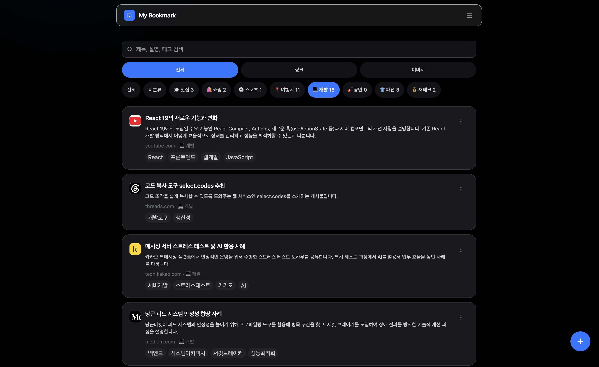
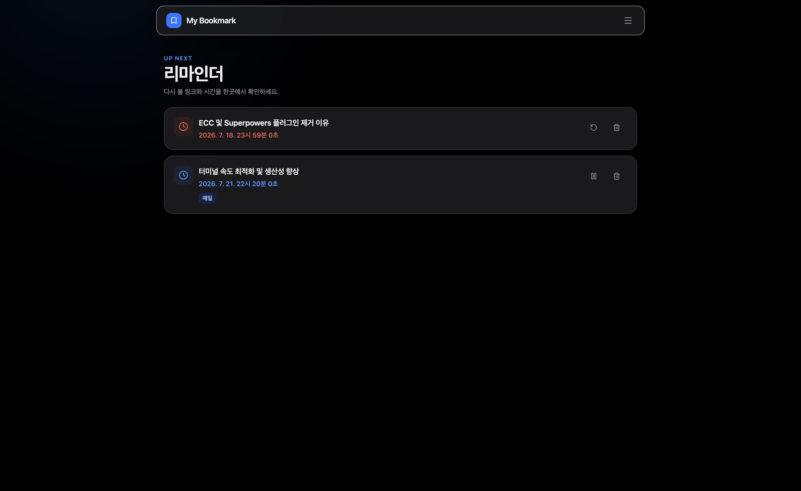
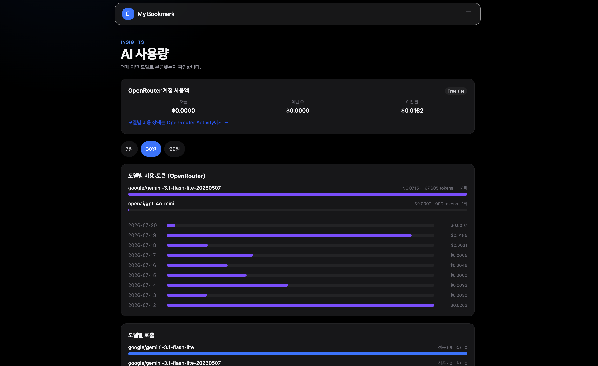

# my-bookmark

북마크 관리 웹서비스. 링크 또는 이미지를 저장하면 **AI가 카테고리를 자동 분류**하고, 특정 시간에 **푸시 리마인더**를 받을 수 있는 서비스

---

## 화면

### 홈 — 북마크 목록 & AI 카테고리 필터

링크·이미지 북마크를 카테고리 칩으로 필터링한다. 등록 시 AI가 제목·설명·태그·카테고리를 자동 생성한다.



### 리마인더 — 다시 볼 링크를 정해둔 시간에 푸시

Web Push(VAPID) + node-cron 스케줄러로 지정한 시각에 알림을 보낸다. 반복(매일) 설정도 지원한다.



### AI 사용량 — 모델별 비용·호출 인사이트

OpenRouter 계정 사용액, 모델별 토큰·호출 수, 일별 추이와 최근 이벤트를 한눈에 확인한다.



---

## 주요 기능

- **AI 자동 분류** — 등록 즉시 응답(201) 후 백그라운드에서 카테고리·태그·메타데이터를 생성
- **OpenRouter 기반 AI** — OpenRouter를 통해 여러 모델로 분류, 설정 화면에서 모델·암호화 API 키 전환
- **PWA** — Web App Manifest + Service Worker로 홈 화면 설치, 모바일 퍼스트 UI
- **Web Push 리마인더** — VAPID 기반 푸시 + node-cron 스케줄러
- **API Key 발급** — 설정 화면에서 API Key를 발급·관리하고, `X-API-Key` 인증으로 외부에서 REST API를 호출
- **AI 사용량 대시보드** — 모델별 비용·토큰·호출 추이 시각화

## 기술 스택

| 영역 | 선택 |
|---|---|
| 패키지 매니저 | Bun workspaces (모노레포) |
| 프론트엔드 | TanStack Start v1 (React 19, Vite), TanStack Query/Form/Virtual |
| 스타일 | Tailwind CSS v4, shadcn/ui 스타일 컴포넌트, lucide-react, sonner |
| 백엔드 | Express 5 (TypeScript, tsx dev / tsup build) |
| DB/인증 | Supabase (Postgres + Auth) |
| AI | OpenRouter |
| 푸시 | web-push (VAPID), node-cron 스케줄러 |
| 품질 도구 | Biome (lint+format), Vitest, TypeScript strict |

## 시작하기

```bash
bun install
bun run dev              # web(:3000) + api(:3001) 동시 실행
```

환경변수는 `.env.example`을 복사해 `.env`로 채운다. 목록과 설명은 [docs/01-architecture.md](./docs/01-architecture.md) 참조.
**secret key, VAPID private key, AI API key는 절대 클라이언트(apps/web)에 노출 금지** — web에는 `VITE_` 접두사 변수만.

### 명령어

```bash
bun run typecheck        # 전 워크스페이스 타입체크
bun run lint             # Biome 검사 (--write로 자동수정)
bun run test             # Vitest
bun run build            # 전 워크스페이스 빌드
```
